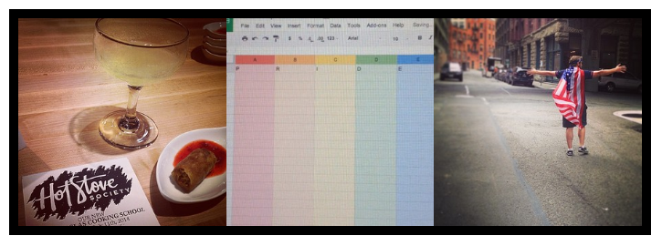

Instagram Responsive Grid
=========================

version **0.0.5**

This library is intended for some quick-usage instagram feed work. Instagram-Grid allows you specify how many images wide and tall you want your feed to be within your specified container. **Requires jQuery** for `ajax` call. *NOTE*: maximum number of images in a single call is *33 images*.

## Setup

Include the `instagram-grid.min.js` and `instagram-grid.min.css` in your project's `<head>`

```HTML
<link href="css/instagram-grid.min.css" rel="stylesheet">
<script type="text/javascript" src="js/instagram-grid.min.js"></script>
```

Initiate the instagram feed via JavaScript

```JS
igrid.init({
	// options
});
```

## Required Parameters

**container**   
`container` defines the element ID you wish to add your feed to. **Must** be an ID

**client_id**   
`client_id` defines your client ID obtained from the instagram API. No authentication needed, just a quick API key. Follow [these steps](https://github.com/svmatthews/instagram-access-token-generation).

**userID**
`userID` defines the specific account from which you are getting the images from. This can be any public instagram account. To obtain the userID from an account, you can [enter the username on this website](http://jelled.com/instagram/lookup-user-id#) and get the key back. *Should be a string value, but an integer will work as well*.

## Optional Parameters

**width**   
`width` in number of images you wish to span the horizontal space of your defined `container`.   
Default: `5`

**height**   
`height` in number of images you wish to span the vertical space of your defined `container`.   
Default: `2`

**link**   
`link` will add clickability to your images, allowing you to click and see a larger version of the image within your site - without linking to Instagram.   
Default: `false`

**caption**   
`caption` is the written caption for the photo on instragram, including hashtags and other usernames. This shows up only underneath the large image if `link` is set to true.   
Default: `true`

**likes**   
`likes` will add a small box in the corner of each image showing the number of likes **IF** the count is *at least one* like.   
Default: `false`

**likesHover**   
`likesHover` is used in hand with `likes` (above) to only show the like count when the user hovers over the image.   
Default: `false`

**clearfix**   
`clearfix` option adds a standard [clearfix](http://nicolasgallagher.com/micro-clearfix-hack/) element to the end of your instagram blocks so your wrapping container element is expanded to the extent of your instagram images.   
Default: `false`

*Clearfix example*   
Before - see the border of the wrapping element does not expand to extent of instagram photos because the insta blocks are outside of the document flow.


After - Clearfixes will fake out the filled extent and push your wrapping element down to the extent of your instagram elemnts.



## Example

Initiate the instagram blocks to span 6 images across and 3 images down within the `#social` element. Clicking the element will show a larger, lightbox version of your image and each image will have the number of likes shown in the lower left corner.

```JS
$(document).ready(function(){
	igrid.init({
		container: 'container',
		client_id: 'your-client-id',
		userID: '257720515', // CMA's instagram userID
		width: 3,
		height: 1,
		link: true,
		likes: true,
		likesHover: true,
		clearfix: true
	});
});
```

## Roadmap

* remove jQuery reliance for ajax call
* build error handler
* more optional parameters
	* ~~linkable options~~
	* ~~linkable within current page (build lightbox)~~ or linkable to instagram website
	* ~~show like counts - boolean parameter - don't show if there aren't any likes for single photos *planned for 0.0.3*~~
* stack images vertically at specific media queries (optional)
* ~~build testing/development environment~~
* ~~add example `gh-pages` branch with user input fields~~
# ~~start recording history~~
* ~~*build this as a real javascript library, rather than a file of accessible functions*~~

## History

**0.0.5** - 7/8/2014

* *new* parameter `caption` sets the caption of the image underneath the large version if `link` is set to `true`. Default is `true` so you would use `false` to turn it off.
* *added* png image in place of svg image for safari svg bug - [issue #11](https://github.com/cmaseattle/instagram-grid/issues/11)
* *removed* CSS3 transitions to prevent image aliasing and other artifacts in safari - [issue #12](https://github.com/cmaseattle/instagram-grid/issues/12)
* *removed* relative path for svg image to now use CDN on gh-pages branch instead of including an `img/` directory.
* *created* test directory with `index.html` - this should be expanded upon more I think.

**0.0.4** - 5/29/2014

* *refactor* library into module-based functions to prevent exposing unecessary functions to client (thanks to [@jczaplew](https://github.com/jczaplew)) - creates `igrid.init()`
* *rename* function to `igrid` to instead of camelCased `instagramGrid`

**0.0.3** - 5/27/2014

* *refactor* code to use `` tags instead of `<div>` with background images, which fixes Firefox and IE issues.
* *update* built-in lightbox UI to use `` tags and has a new 'close' button
* *new* optional parameter `likes` allows user to include like count for images with at least *one* like.
* *new* optional parameter `likesHover` shows number of likes only when the user hovers over the image

**0.0.2**

* added `link` parameter with lightbox - default is `false`
* passing object from initial parameters reduces function-specific parameters and increases readability
* added MIT License

**0.0.1** - Original Release 5/23/2014

* testing environment with simple function-based library
